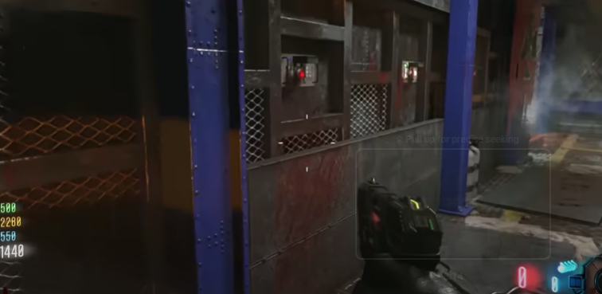
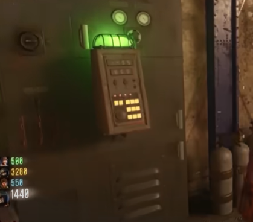
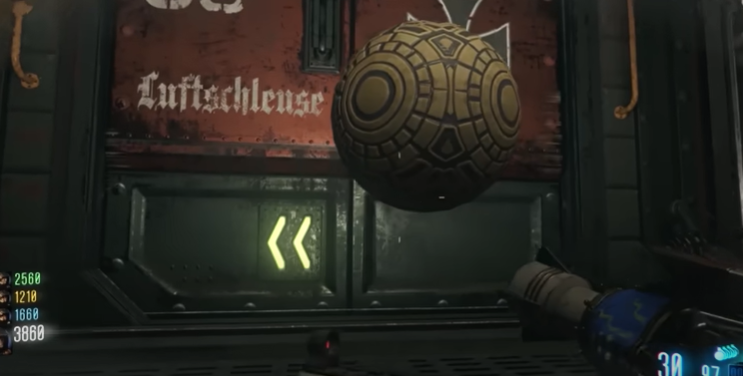
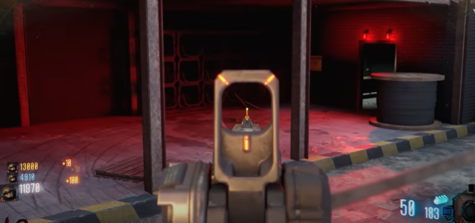
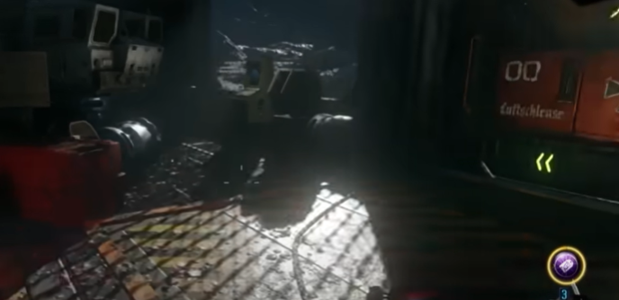
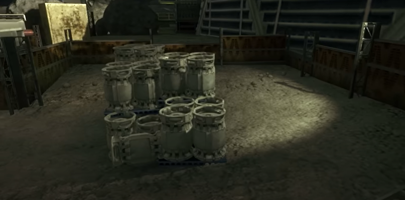

# Moon Main Quest Guide

## Recomended setup:
* Immolation Liquidation (noticing a trend?)

## Note:
* Get the focusing stone from shangri la first
* Hit box looking for the Gersch device, wave gun, and the QED
* Once the Gersch device is obtained, do step 5
* It is pivotal not to decompress te labs area of the map
* Try not to decompress the biodome, tunnel 11, or quick revive room though it is fine if it happens
* Make sure Richtofen is in the game

## Steps

### Step 1:
Turn on power.

### Step 2:
Samantha says!

### Step 3:
Get the hacker in the labs. Using the hacker hack one of the four buttons on the wall in the middle floor of the labs.\
\
\
\
This will start a timer where players need to find four terminals that are glowing green and hack them.\
\
\
\
These terminals can be found on all three floors of the labs, there are eight terminal but only four will be green. Have team spread out, calling out where the four terminals are for the player with the hacker. Once all four are hacked go back to the wall with the four buttons and interact with all of them. Hit all buttons quickley as they are only active for a tiny moment and need to all be on at the same time. This part is easier with more players.

### Step 4:
Wait for tunnel 6 to be breached by the excavator. It is easier to acheive this if the other areas the excavator can breach are not opened. Remove the excavator from tunnel 6 once is has made impact. Inside tunnel 6, there will be this:\
\
\
\
Melee or shoot this throught the tunnels. Be sure not to lose track of it. Eventually it will end up on the dish above quick revive. With the wave gun shoot it down. It will then go into tunnel 11. Keep following it until it goes into the MPD. Kill 25 zombies by the soul jar that rises up from the corner of the MPD. Once filled flip the power switch right next the the soul jar. Recommend you go to area 51 to kill and get points while you have death machines.

### Step 5:
You need a Gersch device for this step. In area 51 there is an area outside the map to the right with some shelves.\
\
\
\
Throw a grenade over there to knock down some panels. Throw a Gersch device on the panels to teleport them onto the tele-pad.

### Step 6:
Throw a QED on the panels that are now next to quick revive. They should be moved into a machine that should be hooked up to the computer next to it in the corner of that room.\
\
\
\
Find an 's' shaped hose that is in the labs. There are tons of locations it could be in so search every corner for it. There is one notable spot for it just outside the labs by these crates:\
\
\
\
Pick up the hose and bring it back to the computer with the panels by quick revive. The player who is playing as Richtofen should interact with the computer, listen to dialog, and repeat for a while until the golden rod is availible to be picked up in between the two panels. Pick it up and go to the MPD. Fill up all four soul jars that are now stationed at each corner of the MPD, 25 kills each. Richtofen should then insert the golden rod into the MPD by interacting with it. He will get all perks.

### Step 7:
Samatha says harder, longer, not faster. Should be three full games?

### Step 8:
Throw at QED at the base of the MPD. Throw a Gersch device right in the area in front of the samantha says game.

### Step 9:
earth go boom
